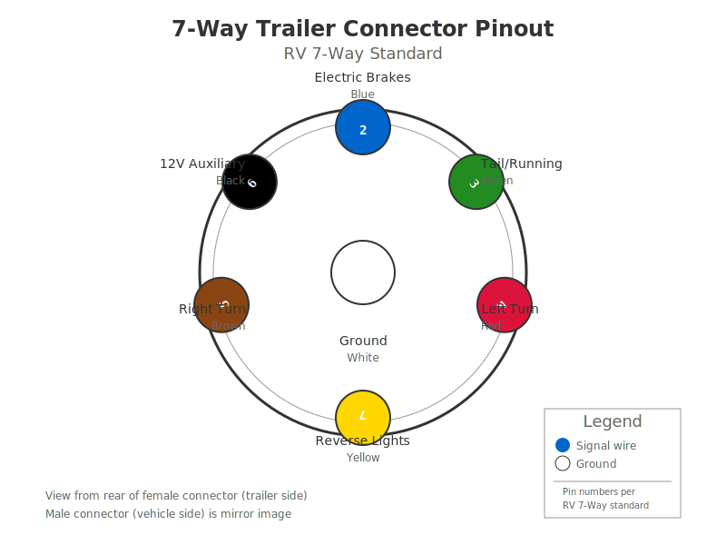

# Circuit Diagrams Gallery

Visual documentation for the trailer-tester hardware design. All diagrams are viewable directly in GitHub.

---

## 📊 System Architecture

### [System Architecture Block Diagram](diagrams/system_architecture.md)

Complete system overview showing all components and their connections:
- Input stage (voltage dividers + protection)
- ADC subsystem (dual ADS1115)
- Microcontroller (RP2040)
- Display subsystem (OLED + NeoPixels)
- Output stage (6 relays)
- Power supply chain
- User interface (buttons)

**Interactive Mermaid diagram** - Click to view

---

## ⚡ Power Circuits

### [Power Supply](diagrams/power_supply.svg)

12V vehicle power → 5V logic → 3.3V analog


**Components:**
- Buck converter (12V → 5V @ 3A)
- LDO regulator (5V → 3.3V)
- 10A fuse protection

---

## 📥 Input Circuits

### [Voltage Divider](diagrams/voltage_divider.svg)

Input voltage scaling for ADC protection (12V → 3.3V range)


**Specifications:**
- R1: 10kΩ (input)
- R2: 2.7kΩ (output tap)
- Scaling factor: 4.7:1
- Zener protection: 3.6V
- Output: 2.55V @ 12V input

---

## 🔌 Communication Bus

### [I2C Bus Topology](diagrams/i2c_bus.svg)

I2C device connections and addressing


**Devices:**
- **ADS1115 #1** @ 0x48 - Channels 0-3 (Brake, Tail, Left, Right)
- **ADS1115 #2** @ 0x49 - Channels 0-1 (Aux, Reverse)
- **SH1107 OLED** @ 0x3C - 128x64 display
- Pull-up resistors: 4.7kΩ on SDA/SCL

---

## 📤 Output Circuits

### [Relay Driver](diagrams/relay_outputs.svg)

Relay switching for trailer output signals


**Features:**
- STEMMA relay boards (built-in drivers)
- 10A rating per channel
- Flyback diode protection
- LED indicators
- GPIO control (D6, D9-D13)

---

## 🔌 Connector Pinout

### [7-Way Connector Pinout](diagrams/connector_pinout.svg)

SAE J2863 standard trailer connector



**Pin Assignments:**
1. **Ground** - White (center pin)
2. **Electric Brakes** - Blue
3. **Tail/Running** - Brown
4. **Left Turn** - Yellow
5. **Right Turn** - Green
6. **12V Auxiliary** - Red
7. **Reverse Lights** - Purple

---

## 🔧 Regenerating Diagrams

Schemdraw-based diagrams can be regenerated:

```bash
# Install dependencies
pip install schemdraw

# Generate all SVG diagrams
python3 docs/diagrams/generate_diagrams.py
```

**What gets regenerated:**
- voltage_divider.svg
- power_supply.svg
- i2c_bus.svg
- relay_outputs.svg

**Manual diagrams** (not regenerated):
- connector_pinout.svg - Hand-crafted SVG
- system_architecture.md - Mermaid diagram in markdown

---

## 📐 Diagram Tools Used

| Tool | Purpose | Format |
|------|---------|--------|
| **Schemdraw** | Circuit schematics | SVG |
| **Mermaid** | Block diagrams | Markdown |
| **Manual SVG** | Custom graphics | SVG |

All formats render natively in GitHub's web interface!

---

## 📚 Related Documentation

- [Hardware Design Document](HARDWARE_DESIGN.md) - Complete specifications
- [Shopping List](SHOPPING_LIST.md) - Adafruit part numbers
- [Development Plan](../DEVELOPMENT_PLAN.md) - Project roadmap

---

*Last updated: December 26, 2024*
