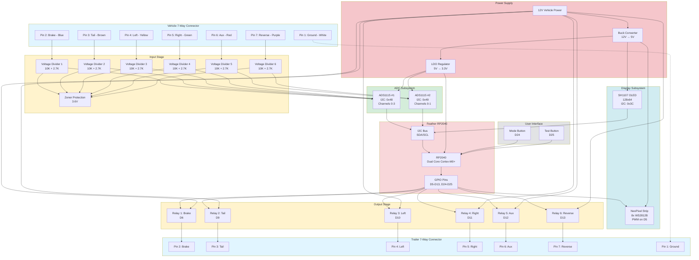

# System Architecture Diagram

## High-Level Block Diagram

## Component Details

| Component | Model | Interface | Address/Pin | Purpose |
|-----------|-------|-----------|-------------|---------|
| **MCU** | Feather RP2040 | - | - | Main controller |
| **ADC #1** | ADS1115 | I2C | 0x48 | Channels 0-3: Brake, Tail, Left, Right |
| **ADC #2** | ADS1115 | I2C | 0x49 | Channels 0-1: Aux, Reverse |
| **Display** | SH1107 OLED | I2C | 0x3C | 128x64 pixel display |
| **LEDs** | WS2812B NeoPixel | PWM | D5 | 8-LED status strip |
| **Relay 1** | STEMMA Relay | GPIO | D6 | Brake output |
| **Relay 2** | STEMMA Relay | GPIO | D9 | Tail output |
| **Relay 3** | STEMMA Relay | GPIO | D10 | Left turn output |
| **Relay 4** | STEMMA Relay | GPIO | D11 | Right turn output |
| **Relay 5** | STEMMA Relay | GPIO | D12 | Aux output |
| **Relay 6** | STEMMA Relay | GPIO | D13 | Reverse output |
| **Mode Button** | Tactile Switch | GPIO | D24 | Mode selection |
| **Test Button** | Tactile Switch | GPIO | D25 | Test trigger |

## Signal Flow

### Vehicle Tester Mode
1. Vehicle signals enter through 7-way connector
2. Voltage dividers scale 12V → 3.3V range
3. Zener diodes protect against overvoltage
4. ADS1115 ADCs read voltages (16-bit resolution)
5. I2C bus transmits readings to RP2040
6. Firmware scales back to original voltage (×4.7)
7. OLED displays voltage readings
8. NeoPixels show active/idle status

### Trailer Tester Mode
1. User presses test button
2. RP2040 activates relays sequentially
3. 12V vehicle power switched through relays
4. Signals output to trailer connector
5. NeoPixels show which output is active
6. OLED displays test progress

### Pass-Through Mode
1. Vehicle signals monitored via ADCs
2. Relays can pass signals to trailer (if needed)
3. Real-time monitoring of all channels
4. Both displays show current state
